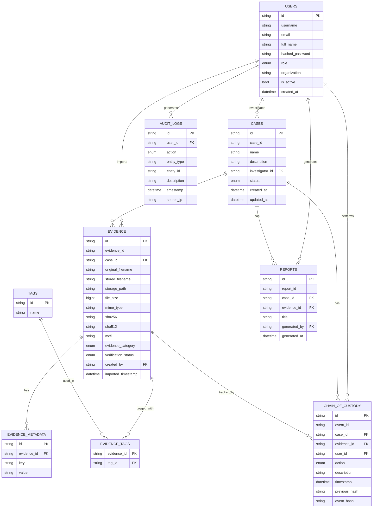
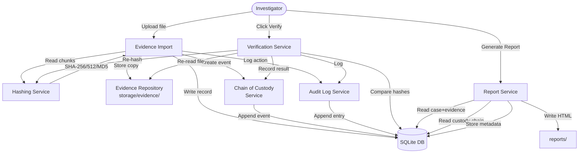
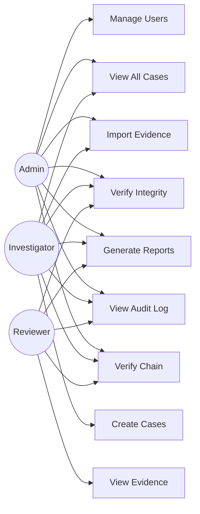
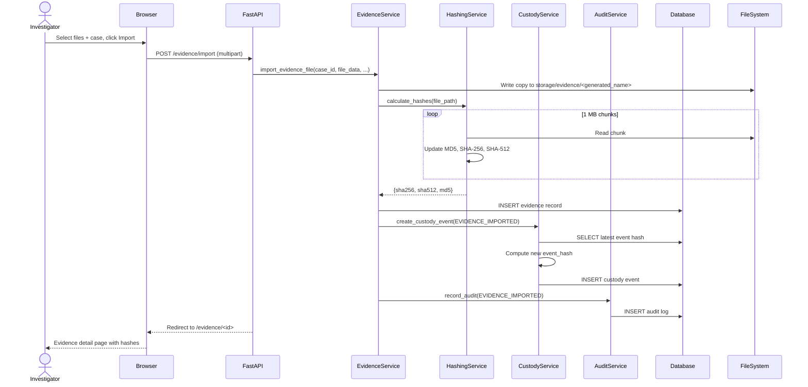
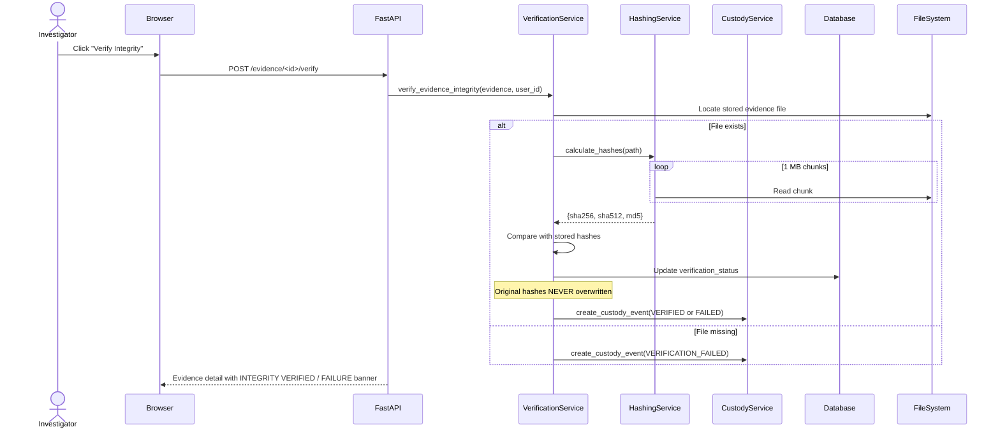

# PROJECT_DOCUMENTATION.md
# Digital Forensics Evidence Organizer
## Academic Project Documentation

---

## 1. Abstract

The Digital Forensics Evidence Organizer (DFEO) is a web-based evidence management system designed for digital forensic investigations. The system enables forensic investigators to securely import, store, organize, and verify digital evidence while maintaining a tamper-evident chain of custody. Built with Python, FastAPI, and SQLite, the application demonstrates the application of cryptographic hashing, database design, secure web development, and digital forensics principles in a practical academic context.

---

## 2. Introduction

Digital forensics is the science of recovering and investigating digital evidence from electronic devices. One of the most critical aspects of a forensic investigation is the management and preservation of digital evidence. Poorly managed evidence can compromise the outcome of legal proceedings.

Traditional manual methods of evidence tracking are error-prone and difficult to audit. This project proposes and implements a software solution that automates evidence management, ensures cryptographic integrity, and maintains a complete, tamper-evident audit history of all actions performed on digital evidence.

---

## 3. Problem Statement

Digital forensic investigations frequently suffer from:
- Inadequate evidence tracking leading to chain-of-custody disputes
- Manual hash verification processes that are slow and error-prone
- Lack of structured audit trails for evidence access and handling
- No centralized repository for multi-examiner investigations
- Risk of accidental evidence modification or execution of malicious files

This system addresses all these problems through a structured, automated approach.

---

## 4. Objectives

1. Provide a secure, web-based interface for managing forensic evidence.
2. Automatically calculate SHA-256, SHA-512, and MD5 hashes on import.
3. Implement a tamper-evident, hash-chained chain of custody.
4. Never modify or execute uploaded evidence files.
5. Support role-based access control (Admin, Investigator, Reviewer).
6. Generate professional forensic evidence reports.
7. Provide comprehensive audit logging.
8. Support import of forensic tool output files (JSON, CSV, TXT).

---

## 5. Existing Systems

| System | Strengths | Weaknesses |
|--------|-----------|------------|
| Autopsy | Powerful analysis | Complex, no web UI |
| FTK (Forensic Toolkit) | Commercial standard | Expensive, proprietary |
| OpenEvidenceBox | Open source | Limited features |
| Manual spreadsheets | Simple | No integrity verification, no chain |

DFEO fills the gap by providing a lightweight, local, web-accessible evidence management system with automatic hash verification and chain-of-custody enforcement.

---

## 6. Proposed System

A web application that:
- Runs locally without cloud dependencies
- Automatically hashes evidence at import using streaming reads
- Maintains an append-only, hash-chained custody log
- Supports multiple investigators with role-based permissions
- Generates printable forensic reports
- Logs all actions in an immutable audit trail

---

## 7. Scope

**In Scope:**
- Evidence file import and storage
- Cryptographic hash calculation (SHA-256, SHA-512, MD5)
- Chain-of-custody management
- Case management
- User authentication and authorization
- Audit logging
- Report generation
- Search and filtering
- Forensic tool output import (JSON, CSV, TXT)

**Out of Scope:**
- Forensic analysis (file carving, memory analysis, etc.)
- Live acquisition from devices
- Cloud storage integration
- Mobile client

---

## 8. Functional Requirements

| ID | Requirement |
|----|-------------|
| FR-01 | System shall accept evidence file uploads |
| FR-02 | System shall calculate SHA-256, SHA-512 and MD5 immediately on import |
| FR-03 | System shall store evidence metadata in a database |
| FR-04 | System shall never modify or execute uploaded files |
| FR-05 | System shall support re-verification of stored hashes |
| FR-06 | System shall maintain an append-only chain-of-custody log |
| FR-07 | System shall detect tampering in the custody chain |
| FR-08 | System shall provide role-based access control |
| FR-09 | System shall generate forensic evidence reports |
| FR-10 | System shall log all user actions |
| FR-11 | System shall support case creation and management |
| FR-12 | System shall support search by filename, hash, ID, and metadata |
| FR-13 | System shall import structured output from forensic tools |

---

## 9. Non-Functional Requirements

| ID | Requirement |
|----|-------------|
| NFR-01 | Passwords shall be stored using bcrypt hashing |
| NFR-02 | Evidence hashing shall use streaming reads (max 1 MB chunk) |
| NFR-03 | All timestamps shall be stored in UTC |
| NFR-04 | Stored filenames shall be system-generated, not user-supplied |
| NFR-05 | The application shall run on a standard laptop without cloud services |
| NFR-06 | The system shall not trust uploaded file content |
| NFR-07 | Audit records shall not be deletable through the UI |
| NFR-08 | Custody records shall be append-only |
| NFR-09 | Reports shall be clearly labelled as derived documents, not evidence |

---

## 10. System Architecture

```
Browser (Bootstrap 5 UI)
         │
         ▼ HTTP
FastAPI Application (Python 3.11)
    ├── Routers (auth, cases, evidence, custody, audit, reports)
    ├── Services (hashing, evidence, custody, verification, audit, report)
    ├── Importers (JSON, CSV, Text)
    └── Database Layer (SQLAlchemy → SQLite)
         │
         ├── storage/evidence/   (binary evidence files)
         └── storage/reports/    (generated HTML reports)
```

---

## 11. Module Description

### 11.1 Authentication Module
Handles login, logout, session management using JWT cookies. Passwords are hashed with bcrypt. Three roles: ADMIN, INVESTIGATOR, REVIEWER.

### 11.2 Case Management Module
Create, view, update forensic cases. Each case has a unique Case ID, status (OPEN/IN_REVIEW/CLOSED/ARCHIVED), and is associated with an investigator.

### 11.3 Evidence Import Module
Accepts one or more files via HTTP multipart upload. For each file: generates a unique Evidence ID, copies to the evidence repository under a generated filename, calculates all three hashes via streaming reads, stores metadata in the database, creates an initial custody event.

### 11.4 Hashing Service
Uses Python's `hashlib` with `hashlib.sha256()`, `hashlib.sha512()` and `hashlib.md5()`. Files are read in 1 MB chunks. This ensures correct operation on files of any size without memory exhaustion.

### 11.5 Verification Service
Re-reads the stored evidence file using the same streaming hash approach. Compares against stored hashes. Never overwrites the stored original hashes regardless of the result. Records the verification result in the custody chain and audit log.

### 11.6 Chain-of-Custody Service
Implements an append-only, hash-chained event log. Each event's hash is computed over: `SHA-256(previous_hash + event_id + evidence_id + action + description + timestamp)`. The first event's `previous_hash` is the literal string `"GENESIS"`. Chain verification walks all events chronologically and recomputes each hash.

### 11.7 Forensic Tool Output Import
A pluggable importer architecture (BaseImporter abstract class) with implementations for JSON, CSV, and plain-text formats. Importers parse metadata from tool output files without executing them.

### 11.8 Report Generation
Generates self-contained HTML forensic reports. Reports are clearly labelled as derived documents. They include case information, evidence details, hashes, verification status, and the full chain of custody.

### 11.9 Audit Log
Application-wide, append-only log of all significant actions. Stored in the `audit_logs` table with user, action type, entity reference, description, timestamp, and source IP.

---

## 12. Database Design

### Tables

| Table | Purpose |
|-------|---------|
| `users` | User accounts and roles |
| `cases` | Forensic investigation cases |
| `evidence` | Evidence items with hashes and metadata |
| `evidence_metadata` | Extended key-value metadata per evidence item |
| `tags` | Tag catalogue |
| `evidence_tags` | Many-to-many evidence ↔ tags |
| `chain_of_custody` | Append-only hash-chained custody log |
| `audit_logs` | Application-wide audit trail |
| `reports` | Generated report metadata |

### Key Fields — Evidence Table

| Column | Type | Description |
|--------|------|-------------|
| `evidence_id` | VARCHAR | Human-readable unique ID (EVD-YYYYMMDDHHMMSS-XXXXXXXX) |
| `original_filename` | VARCHAR | Preserved original filename (never used for storage) |
| `stored_filename` | VARCHAR | System-generated safe storage filename |
| `sha256` | VARCHAR(64) | SHA-256 hash at time of import — never overwritten |
| `sha512` | VARCHAR(128) | SHA-512 hash at time of import |
| `md5` | VARCHAR(32) | MD5 hash (legacy) |
| `verification_status` | ENUM | UNVERIFIED / VERIFIED / FAILED |

### Key Fields — Chain of Custody Table

| Column | Type | Description |
|--------|------|-------------|
| `event_id` | VARCHAR | Unique event UUID |
| `previous_hash` | VARCHAR(64) | Hash of previous event (or "GENESIS") |
| `event_hash` | VARCHAR(64) | SHA-256(prev_hash + event fields + timestamp) |
| `action` | ENUM | EVIDENCE_IMPORTED / VERIFIED / etc. |

---

## 13. Entity-Relationship Diagram



---

## 14. Data Flow Diagram



---

## 15. Use-Case Diagram



---

## 16. Sequence Diagram — Evidence Import



---

## 17. Sequence Diagram — Hash Verification



---

## 18. Chain-of-Custody Explanation

The chain-of-custody is the forensic record of who handled evidence, when, and what they did. In DFEO, this is implemented as a cryptographic hash chain:

**Hash Formula:**
```
event_hash = SHA-256(
    previous_hash     (hex string)
    + event_id        (UUID)
    + evidence_id     (UUID)
    + action          (string)
    + description     (string)
    + timestamp       (ISO 8601)
)
```

**Properties:**
- **Genesis**: The first event uses `"GENESIS"` as `previous_hash`.
- **Chaining**: Each event's `previous_hash` is the previous event's `event_hash`.
- **Tamper detection**: Modifying any field in any event invalidates all subsequent event hashes.
- **Append-only**: The UI and API never allow deleting or updating custody events.
- **Verification**: `verify_custody_chain()` walks all events and recomputes hashes independently.

---

## 19. Security Considerations

| Concern | Mitigation |
|---------|-----------|
| Plaintext passwords | bcrypt hashing via passlib |
| Session hijacking | HTTP-only JWT cookies, configurable expiry |
| SQL injection | SQLAlchemy ORM parameterized queries |
| Path traversal | Storage filenames are always generated UUIDs |
| Malware execution | Files are NEVER executed; only read for hashing and download |
| Privilege escalation | Role checked on every protected route |
| Upload abuse | Max file size limit (default 2 GB) |
| Evidence tampering | Hashes stored at import and never overwritten |
| Log tampering | Audit log is append-only; no delete endpoint |

---

## 20. Testing Strategy

The test suite uses pytest with an in-memory (temporary) SQLite database.

**Test Categories:**

| Category | File | Tests |
|----------|------|-------|
| Hashing | test_hashing.py | SHA-256/512/MD5 known values, large files, streaming |
| Evidence | test_evidence.py | Import, metadata, hashes, tags, relationships, search |
| Custody | test_custody.py | Chain creation, linking, tamper detection, genesis |
| Verification | test_verification.py | Pass, fail, tamper, missing file, hash preservation |
| Authentication | test_auth.py | Password hash, token, login, wrong password, roles |
| API | test_api.py | All major routes, report generation, reviewer blocking |
| Importers | test_importers.py | JSON, CSV, TXT parsing with edge cases |

**Running tests:**
```bash
pytest -v
pytest --cov=app --cov-report=html
```

---

## 21. Results

The implemented system successfully demonstrates:
- Accurate cryptographic hashing (verified against NIST test vectors)
- Tamper detection in both evidence files and custody chains
- Functional web UI with case/evidence management
- Role-based access control enforced at every route
- Complete audit trail
- Printable forensic reports

---

## 22. Limitations

- SQLite suitable for single-user/lab; PostgreSQL recommended for production
- No real-time collaboration features
- Reports are HTML only (PDF via browser print)
- No built-in forensic analysis (only evidence management)
- No hardware write-blocker integration

---

## 23. Future Enhancements

- PostgreSQL backend for multi-user production deployment
- Two-factor authentication (TOTP/FIDO2)
- RESTful JSON API with Swagger documentation
- Integration with Autopsy, Volatility, YARA
- Digital signatures on reports (GPG/PKI)
- Evidence retention policies and automated expiry
- Real-time notifications (WebSocket)
- Timeline visualization of evidence events
- BYOK (Bring Your Own Key) encryption for evidence at rest

---

## 24. Conclusion

The Digital Forensics Evidence Organizer demonstrates a complete, practical implementation of a forensic evidence management system. The system correctly implements core forensic principles: evidence integrity through cryptographic hashing, tamper-evident chain of custody, complete audit logging, and role-based access control. The codebase is structured, tested, and documented to a professional standard suitable for academic submission and real-world educational use.

---

## 25. References

1. NIST Special Publication 800-86: *Guide to Integrating Forensic Techniques into Incident Response*
2. ISO/IEC 27037:2012: *Guidelines for identification, collection, acquisition and preservation of digital evidence*
3. Casey, E. (2011). *Digital Evidence and Computer Crime*. Academic Press.
4. Python Software Foundation: *hashlib — Secure hashes and message digests*. https://docs.python.org/3/library/hashlib.html
5. FastAPI Documentation: https://fastapi.tiangolo.com
6. SQLAlchemy Documentation: https://docs.sqlalchemy.org
7. OWASP: *Cryptographic Storage Cheat Sheet*. https://cheatsheetseries.owasp.org
8. Carrier, B. (2005). *File System Forensic Analysis*. Addison-Wesley.
